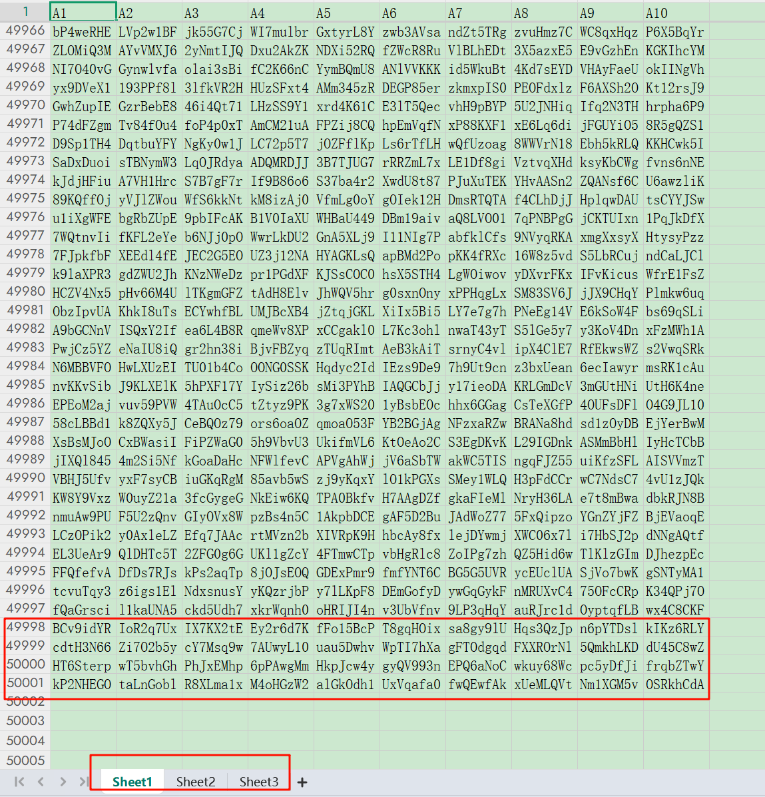

# csv2xlsx
[English README](README.md)

一个快速且简单的开源工具，用于将csv文件转换为xlsx文件

# 转换速度

150k（15万）13MB 的csv文件，转换成xlsx，用时 - 6s


# 使用说明

## 注意（重要）

**要转换的csv文件名称必须为：a.csv**

## 配置文件

config.txt是配置文件

```txt
ROWS_PER_SHEET=50000
CHUNK_SIZE=100000
```

ROWS_PER_SHEET: 每一个sheet页的行数

CHUNK_SIZE: 程序每次分块读取的行数

## 双击exe运行

1. 首先，将要转换的csv文件命名为a.csv（必须，否则无法运行!!!）
2. 双击csv2xlsx.exe 运行
3. 转换成功，打开转换后的xlsx文件

## Cargo运行

```powershell
cargo build
cargo r
```


## 转换效果

### 转换前


### 转换后


