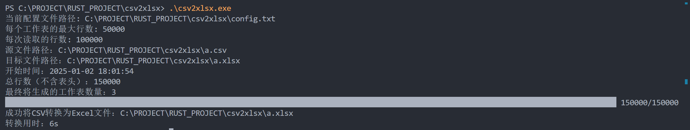
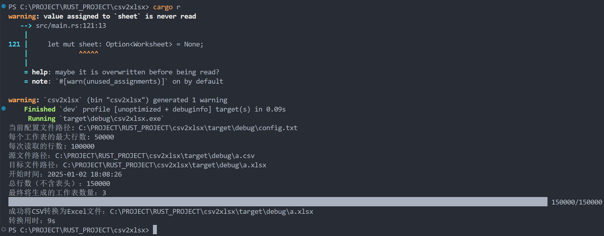
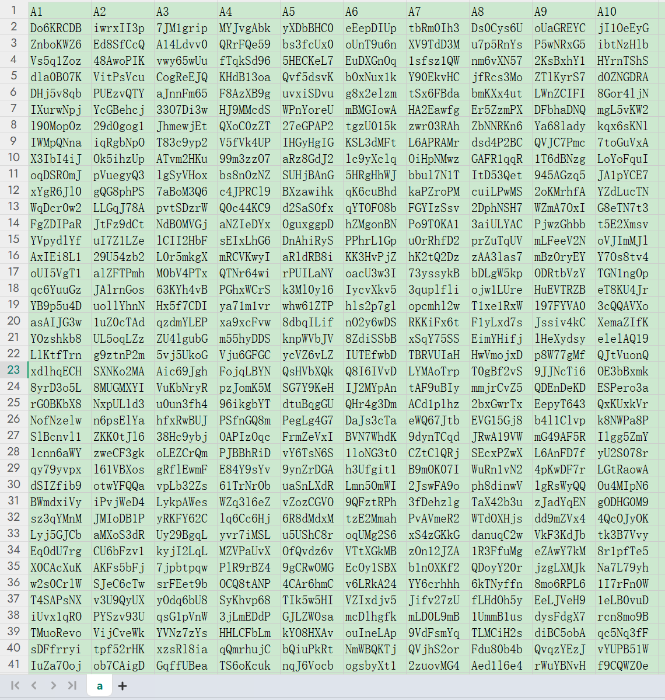
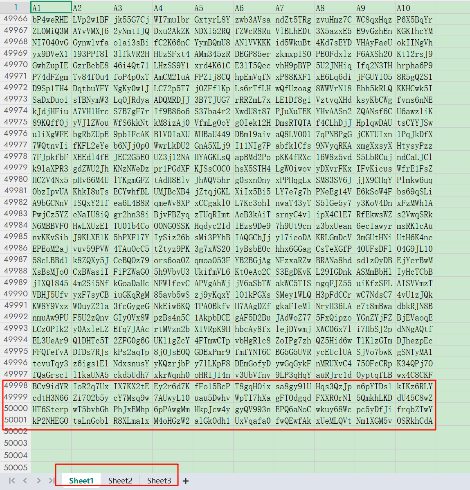

# csv2xlsx
[中文版 README](README-ZH.md)

Fast and simple opensource tool to convert CSV do XLSX

# Speed

csv with 150k rows, 13 MB, with xlsx template - 6s



# Usage

## Notes(Important)

**The name of the csv file to be converted must be a.csv**

## Config File

The config.txt is the config file.

```txt
ROWS_PER_SHEET=50000
CHUNK_SIZE=100000
```

ROWS_PER_SHEET: Number of rows per sheet

CHUNK_SIZE: The number of rows to read each time

## By run exe(release exe)

1. First, name the csv file to be converted as a.csv
2. Double-click to run csv2xlsx.exe
3. The conversion is successful, open the converted file

## By Cargo

```powershell
cargo build
cargo r
```



## Conversion Results

### Before Conversion



### After Conversion


